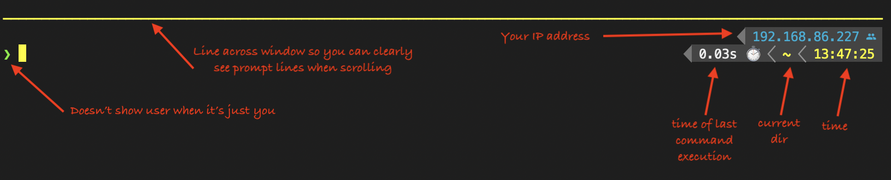
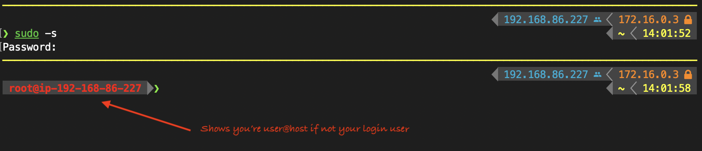
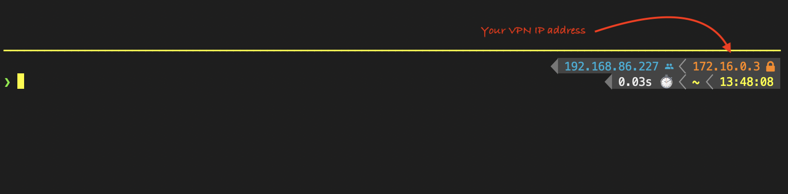
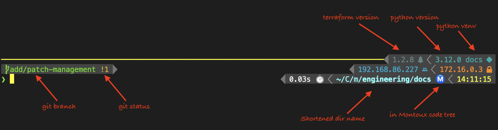
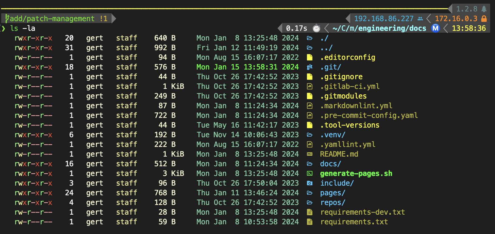

# Set up a decent development environment and make `zsh` shine

This repository contains configuration for `zsh` (aka "dotfiles") and an
installation/update script to make your macOS `zsh` environment fly.

## Installation

Just run `zsh setup.sh` in this directory. It will interactively walk you
through the steps of installing everything you need for a decent development
environment that looks awesome.

This script tries to detect what you have installed and won't overwrite anything
by default.

Command line options:
```text
NAME
    ./setup.sh - Install an amazing development and terminal environment for zsh

SYNOPSYS
    ./setup.sh -h
    ./setup.sh -i [-n] [-y] [-f]

DESCRIPTION
    This script installs a great user experience for zsh and will install
    a range of useful development tools

OPTIONS
    The following options are available:

    -h  show this help and exit.

    -i  Run the installation process.

    -n  dry run: Show what would be installed but don't do anything.

    -y  Answer yes to all questions. This makes the script non-interactive.

    -f  Force installation — don't check if tools are already installed.

EXAMPLES
    ./setup.sh -infy  Run through everything, show what would be installed without installing anything.
```

## What's included

The script makes sure that almost all of the tools you would likely want to use
as a developer are installed and configured. You can safely run this script
multiple times; it will skip things that already appear to be installed.

### An amazing terminal experience

This script will install the following:

* [XCode Command line tools](https://developer.apple.com/xcode/)
* [Homebrew](https://brew.sh/) - The missing package manager for macOS
* [Powerlevel10k](https://github.com/romkatv/powerlevel10k) - fancy fast prompt
* [zsh-syntax-highlighting](https://github.com/zsh-users/zsh-syntax-highlighting) - Fish-like syntax highlighting for Zsh
* [zsh-autosuggestions](https://github.com/zsh-users/zsh-autosuggestions/) - Fish-like autosuggestions for zsh
* [colorls](https://github.com/athityakumar/colorls) - make `ls` look pretty
* [NerdFonts](https://www.nerdfonts.com/) - terminal fonts with icons for PowerLevel10k and colorls

It will also install this repository's `dotfiles/dot-zshrc` into `$HOME/.zshrc`,
which uses all of the magic above to make your terminal experience awesome.

#### The Powerlevel10k prompt that is configured - normal mode



#### After sudo'ing to the root user



#### Showing active VPN connection



#### Showing git info, python venv and terraform version



#### Showing output of colorls (aliased to ls)



### Basic development environment tooling

* [git](https://git-scm.com/) - version control
* [asdf](https://asdf-vm.com/) - tool version manager for many tools
* [pre-commit](https://pre-commit.com/) - manage git pre-commit hooks

**TODO: The following is not implemented yet.**

### Python support

* [Python](https://www.python.org/) - the programming language
* [pipx](https://pipxproject.github.io/pipx/) - install Python tools in isolated
  environments
* [poetry](https://python-poetry.org/) - Python dependency management and
  packaging

### AWS tooling

* [awscli](https://aws.amazon.com/cli/) - AWS command line interface
* [aws-vault](https://github.com/99designs/aws-vault) - securely access AWS credentials

### JavaScript and JSON

* [jq](https://stedolan.github.io/jq/) - command line JSON processor
* [NodeJS](https://nodejs.org/en/) - JavaScript runtime

### Virtual Machines

* [Docker](https://www.docker.com/) - Container magic
* [Vagrant](https://www.vagrantup.com/) - Virtual machines made easy
* [QEMU](https://www.qemu.org/) - Virtual machine emulator for different CPUs
* [UTM](https://getutm.app/) - macOS app for running QEMU virtual machines
* [vagrant-qemu](https://github.com/ppggff/vagrant-qemu) - adds QEMU provider to vagrant
